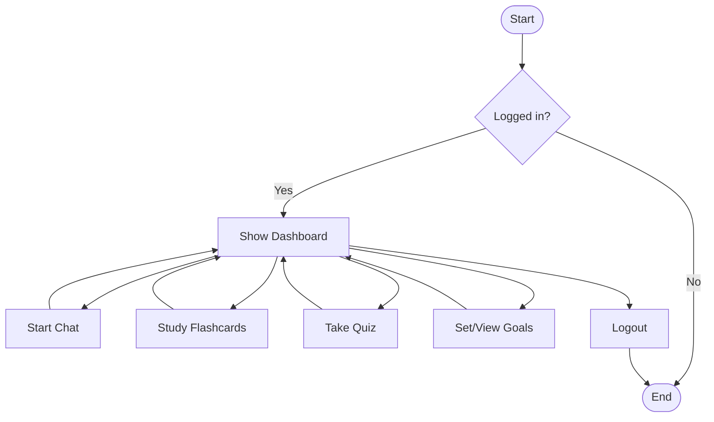
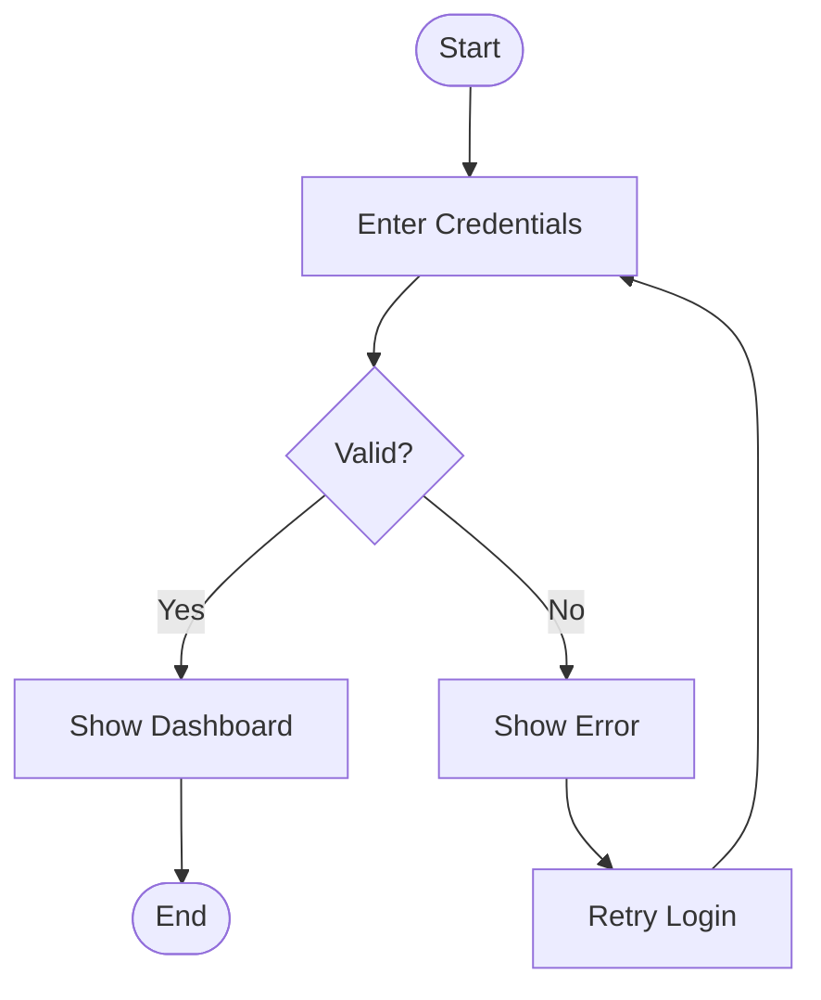
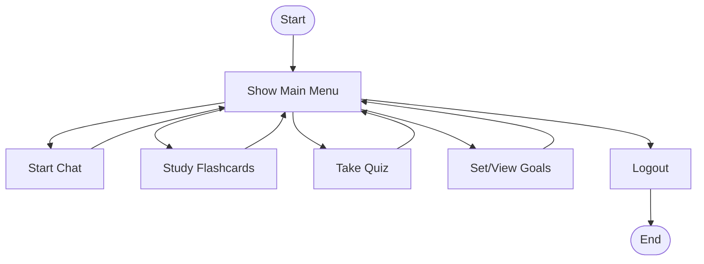
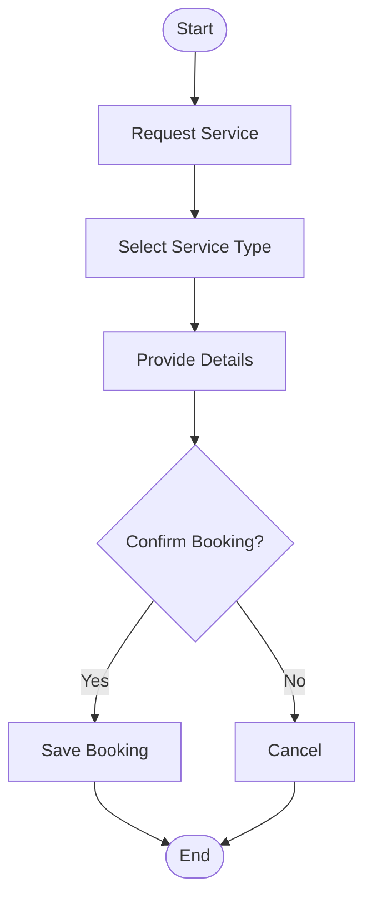
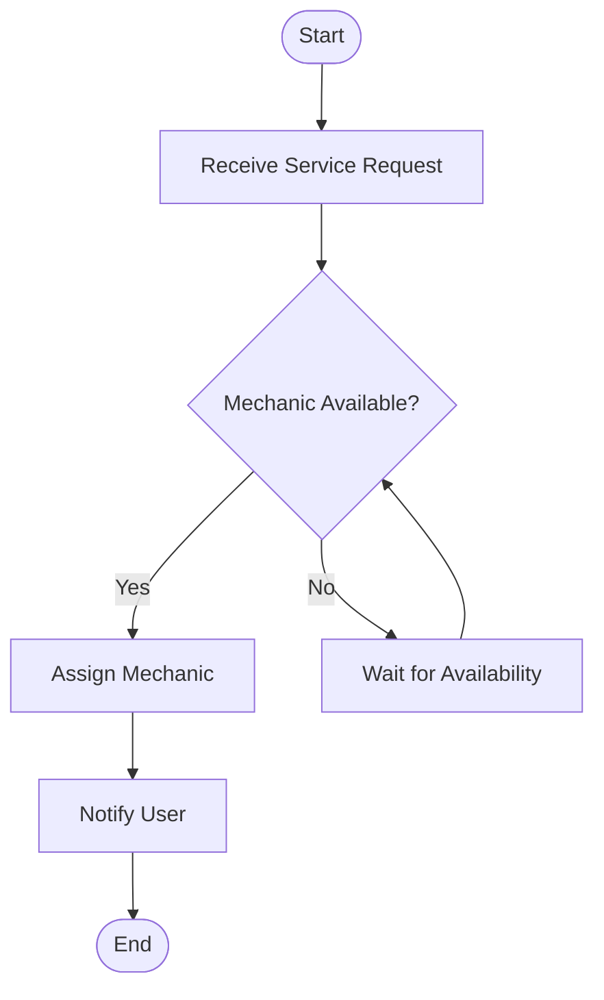

# Activity Diagrams

## User Activity Diagram

```mermaid
flowchart TD
    Start([Start])
    Login{Logged in?}
    Dashboard[Show Dashboard]
    Chat[Start Chat]
    Flashcard[Study Flashcards]
    Quiz[Take Quiz]
    Goal[Set/View Goals]
    Logout[Logout]
    End([End])

    Start --> Login
    Login -- No --> End
    Login -- Yes --> Dashboard
    Dashboard --> Chat
    Dashboard --> Flashcard
    Dashboard --> Quiz
    Dashboard --> Goal
    Dashboard --> Logout
    Chat --> Dashboard
    Flashcard --> Dashboard
    Quiz --> Dashboard
    Goal --> Dashboard
    Logout --> End
```

## User Login Activity Diagram

```mermaid
flowchart TD
    Start([Start])
    EnterCreds[Enter Credentials]
    Validate{Valid?}
    Success[Show Dashboard]
    Fail[Show Error]
    Retry[Retry Login]
    End([End])

    Start --> EnterCreds
    EnterCreds --> Validate
    Validate -- Yes --> Success
    Validate -- No --> Fail
    Fail --> Retry
    Retry --> EnterCreds
    Success --> End
```

## Main Menu Activity Diagram

```mermaid
flowchart TD
    Start([Start])
    MainMenu[Show Main Menu]
    Chat[Start Chat]
    Flashcard[Study Flashcards]
    Quiz[Take Quiz]
    Goal[Set/View Goals]
    Logout[Logout]
    End([End])

    Start --> MainMenu
    MainMenu --> Chat
    MainMenu --> Flashcard
    MainMenu --> Quiz
    MainMenu --> Goal
    MainMenu --> Logout
    Chat --> MainMenu
    Flashcard --> MainMenu
    Quiz --> MainMenu
    Goal --> MainMenu
    Logout --> End
```

## Service Booking Activity Diagram

```mermaid
flowchart TD
    Start([Start])
    BookService[Request Service]
    SelectType[Select Service Type]
    ProvideDetails[Provide Details]
    Confirm{Confirm Booking?}
    Save[Save Booking]
    Cancel[Cancel]
    End([End])

    Start --> BookService
    BookService --> SelectType
    SelectType --> ProvideDetails
    ProvideDetails --> Confirm
    Confirm -- Yes --> Save
    Confirm -- No --> Cancel
    Save --> End
    Cancel --> End
```

## Allocation of Mechanic Activity Diagram

```mermaid
flowchart TD
    Start([Start])
    ReceiveRequest[Receive Service Request]
    CheckAvailability{Mechanic Available?}
    Assign[Assign Mechanic]
    Notify[Notify User]
    Wait[Wait for Availability]
    End([End])

    Start --> ReceiveRequest
    ReceiveRequest --> CheckAvailability
    CheckAvailability -- Yes --> Assign
    Assign --> Notify
    Notify --> End
    CheckAvailability -- No --> Wait
    Wait --> CheckAvailability
```
