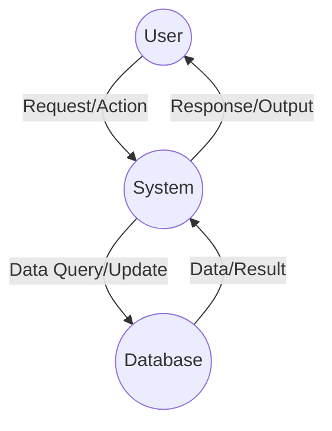
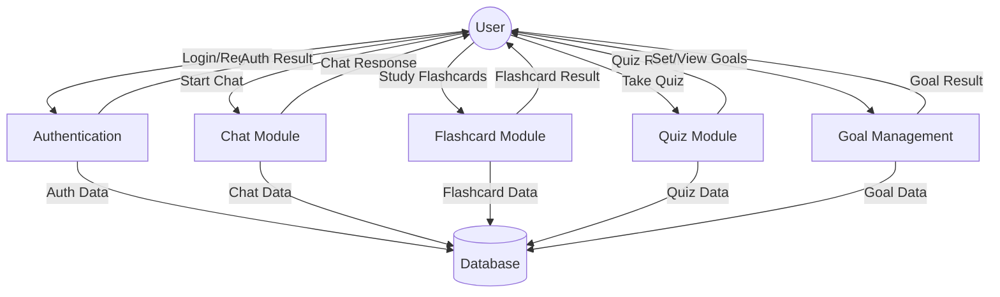

# Data Flow Diagrams

## Level 0

```mermaid
flowchart TD
    User((User))
    System((System))
    Database((Database))
    
    User -- Request/Action --> System
    System -- Data Query/Update --> Database
    Database -- Data/Result --> System
    System -- Response/Output --> User
```

## Level 1

```mermaid
flowchart TD
    User((User))
    Auth[Authentication]
    Chat[Chat Module]
    Flashcard[Flashcard Module]
    Quiz[Quiz Module]
    Goal[Goal Management]
    DB[(Database)]

    User -- Login/Register --> Auth
    Auth -- Auth Data --> DB
    Auth -- Auth Result --> User

    User -- Start Chat --> Chat
    Chat -- Chat Data --> DB
    Chat -- Chat Response --> User

    User -- Study Flashcards --> Flashcard
    Flashcard -- Flashcard Data --> DB
    Flashcard -- Flashcard Result --> User

    User -- Take Quiz --> Quiz
    Quiz -- Quiz Data --> DB
    Quiz -- Quiz Result --> User

    User -- Set/View Goals --> Goal
    Goal -- Goal Data --> DB
    Goal -- Goal Result --> User
```

## Level 2

```mermaid
flowchart TD
    User((User))
    Auth[Authentication]
    Register[Register]
    Login[Login]
    Chat[Chat Module]
    NewChat[Start New Chat]
    ContinueChat[Continue Chat]
    Flashcard[Flashcard Module]
    ViewSets[View Flashcard Sets]
    StudyCard[Study Flashcard]
    Quiz[Quiz Module]
    TakeQuiz[Take Quiz]
    ViewResults[View Quiz Results]
    Goal[Goal Management]
    SetGoal[Set Goal]
    ViewGoal[View Goals]
    DB[(Database)]

    User -- Register --> Register
    Register -- Store User --> DB
    Register -- Success/Fail --> User

    User -- Login --> Login
    Login -- Check Credentials --> DB
    Login -- Auth Result --> User

    User -- Start Chat --> NewChat
    NewChat -- Create Session --> DB
    NewChat -- Chat Response --> User
    User -- Continue Chat --> ContinueChat
    ContinueChat -- Fetch Session --> DB
    ContinueChat -- Chat Response --> User

    User -- View Flashcard Sets --> ViewSets
    ViewSets -- Fetch Sets --> DB
    ViewSets -- Sets List --> User
    User -- Study Flashcard --> StudyCard
    StudyCard -- Fetch Card --> DB
    StudyCard -- Card Data --> User

    User -- Take Quiz --> TakeQuiz
    TakeQuiz -- Fetch Quiz --> DB
    TakeQuiz -- Quiz Data --> User
    User -- View Quiz Results --> ViewResults
    ViewResults -- Fetch Results --> DB
    ViewResults -- Results Data --> User

    User -- Set Goal --> SetGoal
    SetGoal -- Store Goal --> DB
    SetGoal -- Success/Fail --> User
    User -- View Goals --> ViewGoal
    ViewGoal -- Fetch Goals --> DB
    ViewGoal -- Goals Data --> User
```
