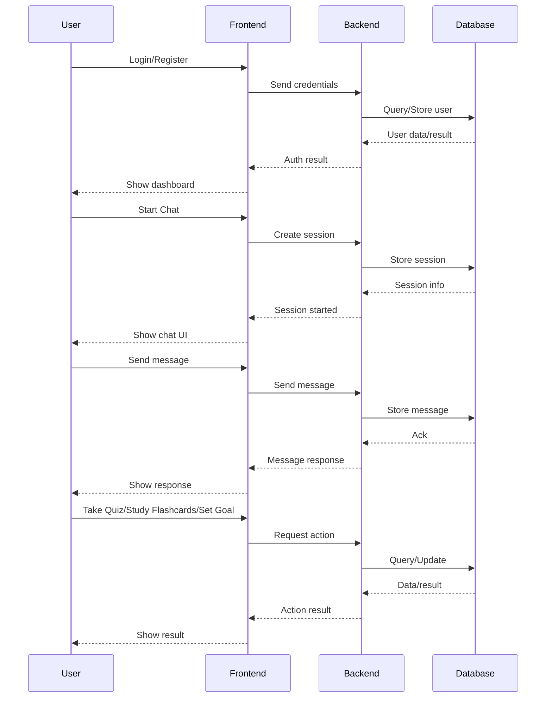
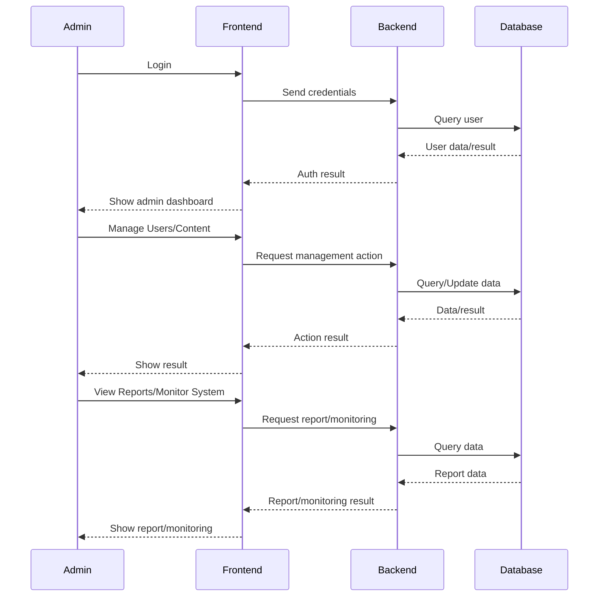

# Sequence Diagrams

## User Sequence Diagram

```mermaid
sequenceDiagram
    participant User
    participant Frontend
    participant Backend
    participant Database
    User->>Frontend: Login/Register
    Frontend->>Backend: Send credentials
    Backend->>Database: Query/Store user
    Database-->>Backend: User data/result
    Backend-->>Frontend: Auth result
    Frontend-->>User: Show dashboard
    User->>Frontend: Start Chat
    Frontend->>Backend: Create session
    Backend->>Database: Store session
    Database-->>Backend: Session info
    Backend-->>Frontend: Session started
    Frontend-->>User: Show chat UI
    User->>Frontend: Send message
    Frontend->>Backend: Send message
    Backend->>Database: Store message
    Database-->>Backend: Ack
    Backend-->>Frontend: Message response
    Frontend-->>User: Show response
    User->>Frontend: Take Quiz/Study Flashcards/Set Goal
    Frontend->>Backend: Request action
    Backend->>Database: Query/Update
    Database-->>Backend: Data/result
    Backend-->>Frontend: Action result
    Frontend-->>User: Show result
```

## Admin Sequence Diagram

```mermaid
sequenceDiagram
    participant Admin
    participant Frontend
    participant Backend
    participant Database
    Admin->>Frontend: Login
    Frontend->>Backend: Send credentials
    Backend->>Database: Query user
    Database-->>Backend: User data/result
    Backend-->>Frontend: Auth result
    Frontend-->>Admin: Show admin dashboard
    Admin->>Frontend: Manage Users/Content
    Frontend->>Backend: Request management action
    Backend->>Database: Query/Update data
    Database-->>Backend: Data/result
    Backend-->>Frontend: Action result
    Frontend-->>Admin: Show result
    Admin->>Frontend: View Reports/Monitor System
    Frontend->>Backend: Request report/monitoring
    Backend->>Database: Query data
    Database-->>Backend: Report data
    Backend-->>Frontend: Report/monitoring result
    Frontend-->>Admin: Show report/monitoring
```
